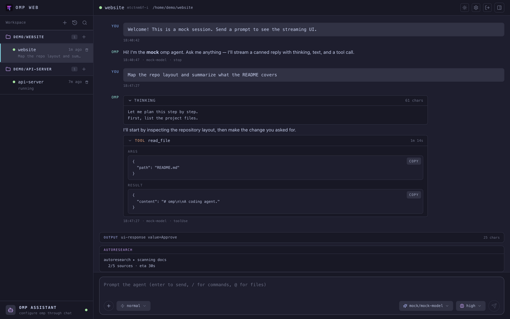
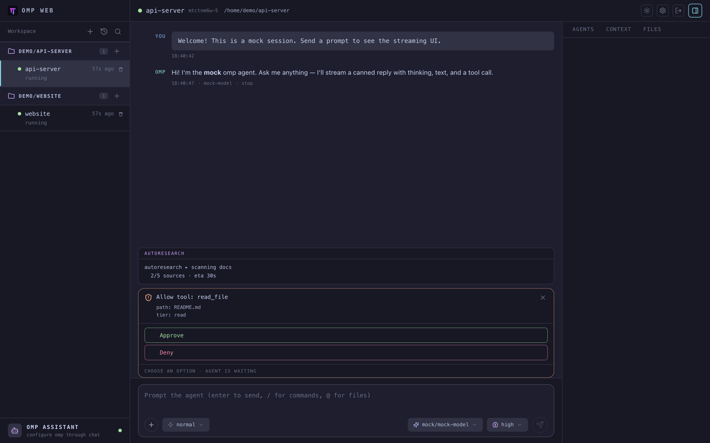
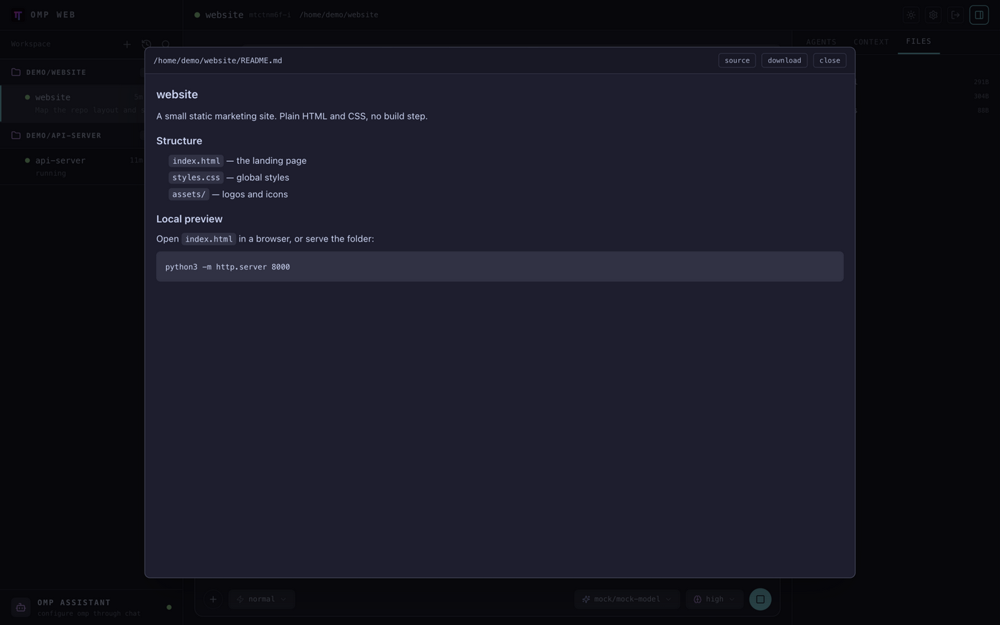
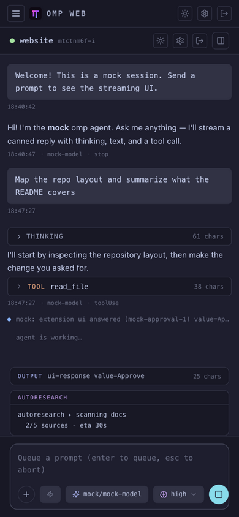
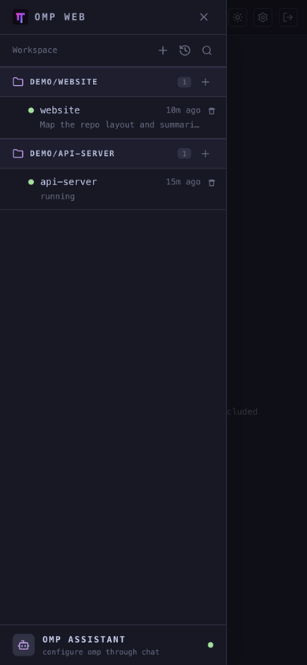
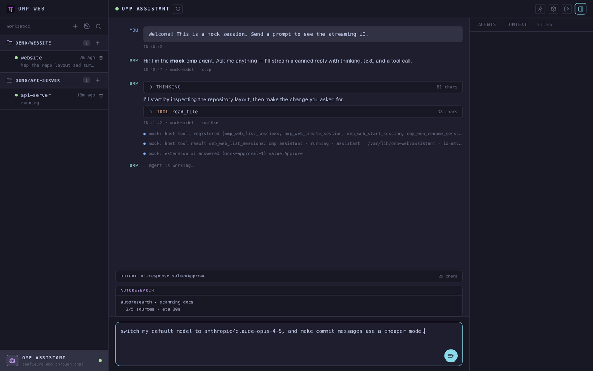
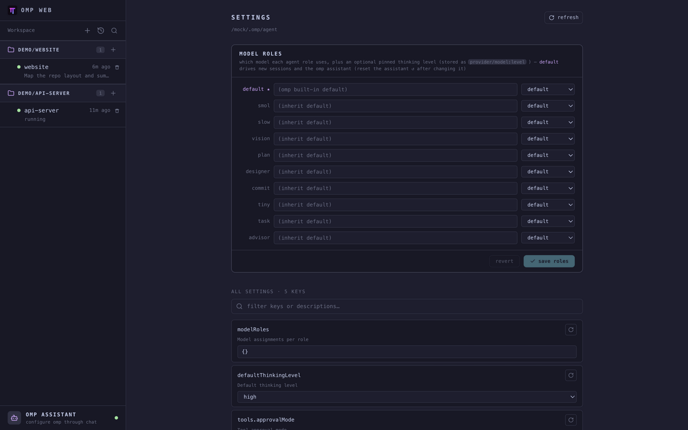

# omp-web

[](https://github.com/danielglh/omp-web/actions/workflows/ci.yml)

English | [简体中文](docs/README.zh-CN.md)

Use [omp](https://omp.sh/) — a terminal coding agent — from a browser: start sessions, send prompts, watch the transcript stream, approve tool calls, change omp's configuration. Works on a desktop and on a phone.

## Why I built this

Purely a personal need. My omp agents run on a remote development server, but I'm not always sitting in front of a terminal — and SSH + tmux from a phone is nobody's idea of a good time. I want to kick off a task at my desk, check on it from the couch, approve a tool call from my phone on the train.

So this is the remote control: omp keeps running on the server, agent and tools included (nothing executes in the browser), and the web UI drives it. It ships as a single Bun process; put TLS in front and it's safe to expose, token auth included.

## What it does

**Sessions.** The rail on the left groups sessions by working directory, each with its own `+` button. Sessions can resume from omp's own history, survive server restarts, and each one gets its own approval tier (`always-ask` / `write` / `yolo`).

**A real chat UI.** Streaming transcript with collapsible thinking blocks and tool-call cards (args, live output, timing). The composer has `/` command completion, `@` file references, image paste, and model / thinking-level chips. You can queue follow-ups while the agent works, or interrupt it.



When the agent wants to touch something, the approval lands in the chat as a dialog — on a phone too:



**The stuff around the chat.** Side panel with live subagent status, context usage, token/cost stats, HTML export. You can also browse the session's working directory and preview files — markdown, images, HTML — so agent output can be read without downloading anything.



**The phone is a first-class citizen.** Rail and side panel turn into drawers on narrow screens:

| |
| --- |
|   |

## omp assistant: configure omp by asking

The part I care about most.

omp has hundreds of config keys — model roles, providers, approvals, compaction, per-tool toggles. The usual move is to build a settings UI for them: a form per key, and a UI that's always one release behind omp itself. I didn't want to maintain that, and I didn't want to use it either.

So omp-web doesn't have a config UI to speak of. It has an agent instead. The sidebar carries a permanent **omp assistant**: an omp session running in its own workspace, seeded with a context file that describes omp's configuration system. You talk to it:

- "use claude-opus-4-5 as the default model"
- "make commit messages use a cheaper model"
- "turn off those two providers"

It does the change by running the real `omp config` CLI — exactly what you'd type in a terminal, same validation, same semantics — and reports back the resulting value. One catch: the assistant runs on the `default` model role, so after changing it, hit ↺ to restart the assistant.

It can manage omp-web itself, too: list, create (with an approval tier and model), start, stop, rename, and delete sessions, all from the conversation. "Start a yolo session in this repo and work on X" is one sentence, not a form.



There is still a plain settings page — a modelRoles editor plus a searchable catalog of every omp config key — for the moments you want to see or set one exact value:



## Install & use

You need [Bun](https://bun.sh) ≥ 1.3.14, and [omp](https://omp.sh/install) on the server with a provider API key configured.

```sh
git clone https://github.com/danielglh/omp-web.git
cd omp-web
bun install
bun run build
bun run start        # listens on :7367
```

Open `http://<server>:7367`.

Before exposing it to a network, set an auth token — recommended via the data dir:

```sh
mkdir -p ~/.omp-web
echo '{ "authToken": "pick-something-long" }' > ~/.omp-web/config.json
chmod 600 ~/.omp-web/config.json
```

`OMP_WEB_TOKEN` also works and wins over the file. No token means no auth — fine on localhost only. Logging in exchanges the token for an HttpOnly cookie (30 days); logout or rotating the token revokes live sessions, and the cookie is flagged `Secure` automatically behind an HTTPS proxy.

Fair warning: a running agent can execute tools on that server. Treat the UI as a remote shell and keep the token private.

Behind nginx/Caddy, forward `/api` and `/ws` (including the WebSocket upgrade) to the server. Everything else has defaults:

| Variable           | Default      | Meaning                                  |
| ------------------ | ------------ | ---------------------------------------- |
| `OMP_WEB_TOKEN`    | —            | Access token (overrides `config.json`)   |
| `OMP_WEB_PORT`     | `7367`       | HTTP/WS port                             |
| `OMP_WEB_HOST`     | `0.0.0.0`    | Bind address                             |
| `OMP_WEB_DATA_DIR` | `~/.omp-web` | State (session registry, auth, assistant) |
| `OMP_WEB_OMP_BIN`  | `omp`        | omp binary path                          |
| `OMP_WEB_CWD`      | `$HOME`      | Default working directory for new sessions |
| `OMP_WEB_MOCK`     | —            | `1` spawns a scripted fake agent instead of omp |

## Local development

```sh
bun install
bun run dev          # Bun server (:7367) + vite (:5173) with HMR
```

No omp install needed for UI work: `OMP_WEB_MOCK=1 bun run dev:server` spawns a scripted fake agent instead (streams replies, raises approvals, runs a subagent); the test suite uses it too.

```sh
bun run check        # biome (lint + format) + typecheck
bun run test         # server E2E + web unit tests, no omp required
```

The repo has three packages: `server/` (Bun — auth, session manager, omp subprocess bridge), `web/` (React 19 + Vite + Tailwind v4), `shared/` (wire types). In one sentence: the server spawns one `omp --mode rpc` subprocess per session and bridges its stdin/stdout JSON protocol to WebSockets, so there's nothing to install client-side and everything runs on the server.

## License

[MIT](LICENSE)
